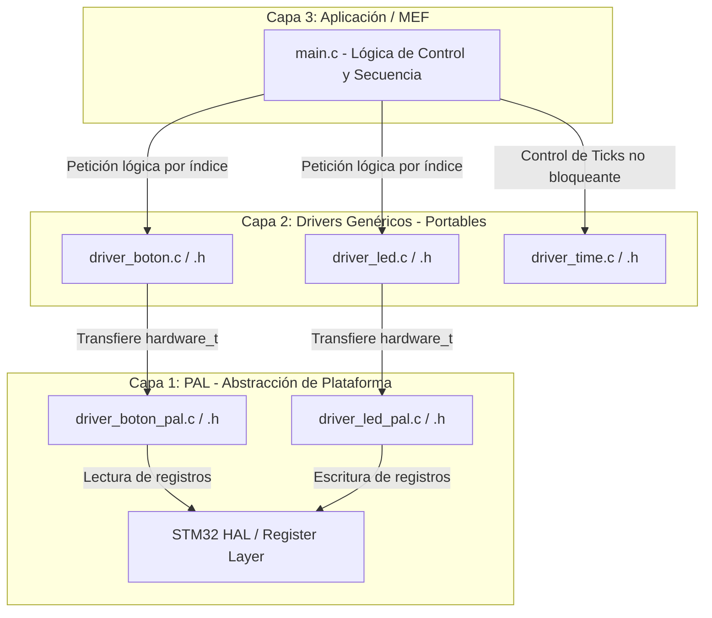

# APP 1.2 -Secuencia de LEDs Bidireccional- con Arquitectura Modular en 3 Capas (STM32)

## Título y Objetivos
* **Implementar una arquitectura de software portable en 3 capas:** Separar la lógica de aplicación (Capa 3), los drivers genéricos independientes del silicio (Capa 2) y la Capa de Abstracción de Plataforma / PAL (Capa 1).
* **Control de actuadores y sensores mediante abstracción:** Gestionar una secuencia de LEDs y la lectura de flancos de un pulsador mediante índices lógicos sin depender de los registros o la HAL de la plataforma en la capa de aplicación.

---

## Especificaciones del Circuito
* **Placa de Desarrollo:** NUCLEO-F439ZI (STM32F439ZI)
* **Entradas:** 1x Pulsador de Usuario (Configurado en la PAL como `BOTON_ACTIVO_ALTO` según el hardware).
* **Salidas:** 3x LEDs de Usuario (Configurados mediante tabla de mapeo físico en la PAL).

---

## Teoría de Operación
El sistema ejecuta una **Máquina de Estados Finitos (MEF)** para conmutar una serie de $N$ LEDs de forma secuencial con un periodo configurable (200 ms en estado encendido y 200 ms en apagado).

1. **Inversión de Sentido (Detección de Flanco):**
   En cada iteración del lazo principal (`while(1)`), se evalúa la entrada del pulsador mediante la función `BOTON_DetectarFlancoPresionado()`. Al detectar la transición lógica de suelto a presionado ($0 \rightarrow 1$), la variable `sentido` invierte su signo ($1 \rightarrow -1$ o $-1 \rightarrow 1$).
2. **Ciclo de Estados y Lógica Circular:**
   La MEF conmuta el LED indexado por `indice_led`. Al completar la fase de apagado, actualiza la posición del siguiente LED sumando el valor de `sentido`:
   
   $$\text{indice\_led} \leftarrow \text{indice\_led} + \text{sentido}$$
   
   Para garantizar que el índice permanezca dentro de los límites del arreglo sin desbordar memoria, se aplica la siguiente corrección circular:
   
   $$\text{indice\_led} = \begin{cases} 0 & \text{si } \text{indice\_led} \ge \text{LED\_GetCount()} \\ \text{LED\_GetCount()} - 1 & \text{si } \text{indice\_led} < 0 \end{cases}$$

---

## Arquitectura del Software

El proyecto se estructura en 3 capas jerárquicas con aislamiento de dependencias:



### Detalle Capa 1: Abstracción de Plataforma (PAL)
Es la única capa acoplada al hardware específico (STM32 HAL / Registros). Asocia las estructuras lógicas genéricas con las variables físicas del microcontrolador (`GPIO_TypeDef*` y `uint16_t pin`) y normaliza la polaridad eléctrica (`BOTON_ACTIVO_ALTO` / `BOTON_ACTIVO_BAJO`).

#### `driver_boton_pal.h`
```c
typedef struct {
    GPIO_TypeDef* puerto;   ///< Puerto GPIO real de la MCU (GPIOA, GPIOB, etc.)
    uint16_t pin;           ///< Pin físico real de la MCU (GPIO_PIN_X)
    Boton_Modo_t modo;      ///< Polaridad eléctrica
} BOTON_Hardware_t;

void BOTON_PAL_Init(const BOTON_Hardware_t* tabla, uint8_t cantidad);
bool BOTON_PAL_LeerPinFisico(uint8_t indice);
```

#### `driver_boton_pal.c`
```c
bool BOTON_PAL_LeerPinFisico(uint8_t indice) {
    if (indice >= cantidad_botones_plataforma || tabla_botones_plataforma == NULL) {
        return false;
    }
    GPIO_PinState estado_real = HAL_GPIO_ReadPin(tabla_botones_plataforma[indice].puerto, tabla_botones_plataforma[indice].pin);

    if (tabla_botones_plataforma[indice].modo == BOTON_ACTIVO_BAJO) {
        return (estado_real == GPIO_PIN_RESET);
    } else {
        return (estado_real == GPIO_PIN_SET);
    }
}
```

#### `driver_led_pal.h`
```c
typedef struct {
    GPIO_TypeDef* port;   ///< Puerto GPIO de la MCU (GPIOA, GPIOB, etc.)
    uint16_t pin;         ///< Pin de la MCU (GPIO_PIN_X)
} LED_Hardware_t;

void LED_PAL_Init(const LED_Hardware_t* tabla, uint8_t cantidad);
void LED_PAL_Write(uint8_t indice, bool estado);
void LED_PAL_Toggle(uint8_t indice);
```

#### driver_led_pal.c
```c
void LED_PAL_Write(uint8_t indice, bool estado) {
    if (indice >= cantidad_leds_plataforma || tabla_leds_plataforma == NULL) {
        return;
    }
    GPIO_PinState estado_pin = (estado) ? GPIO_PIN_SET : GPIO_PIN_RESET;
    HAL_GPIO_WritePin(tabla_leds_plataforma[indice].port, tabla_leds_plataforma[indice].pin, estado_pin);
}
```

### Detalle Capa 2: Drivers Genéricos
Esta capa reúne la lógica algorítmica y abstracta del sistema, funcionando de manera totalmente independiente del hardware subyacente (100% portable a plataformas como AVR, NXP o bare-metal). Su responsabilidad es resolver el comportamiento lógico de los componentes sin conocer puertos, registros ni periferia física.

* **Driver de Botones (`driver_boton`):** Implementa la memoria de estados pasados mediante arreglos estáticos para calcular y capturar eventos por flanco (transición de suelto a presionado o viceversa). Elimina la necesidad de gestionar banderas manuales en la aplicación y abstrae el estado eléctrico a un concepto booleano puro (`true` = presionado).
* **Driver de LEDs (`driver_led`):** Gestiona el registro dinámico en tiempo de compilación/inicialización de los actuadores lumínicos del sistema. Expone una interfaz sencilla basada en índices lógicos (`0, 1, 2...`) para operaciones de encendido, apagado, alternancia (*toggle*) y consulta de cantidad total de elementos.
* **Driver de Tiempo (`driver_time`):** Ofrece una solución integral para el control de la base de tiempo, soportando tanto **retardos bloqueantes tradicionales** (`TIME_DelayMS`) para esperas síncronas simples, como **temporizadores no bloqueantes por software** (`Timer_t`). Esta última modalidad resuelve la diferencia entre marcas de tiempo (*ticks*) mediante aritmética modular en `uint32_t`, garantizando inmunidad total al desbordamiento (*overflow*) del contador del sistema.

#### `driver_boton.c`
```c
bool BOTON_DetectarFlancoPresionado(uint8_t indice_boton) {
    if (indice_boton >= botones_registrados) {
        return false;
    }

    bool estado_actual = BOTON_PAL_LeerPinFisico(indice_boton);
    bool flanco_detectado = false;

    if (estado_actual == true && estado_anterior_botones[indice_boton] == false) {
        flanco_detectado = true;
    }

    estado_anterior_botones[indice_boton] = estado_actual;
    return flanco_detectado;
}
```

#### driver_led.c

```c
void LED_Write(uint8_t indice_led, bool estado) {
    if (indice_led < leds_registrados) {
        LED_PAL_Write(indice_led, estado);
    }
}

uint8_t LED_GetCount(void) {
    return leds_registrados;
}
```

#### driver_time.c
```c
void TIME_DelayMS(uint32_t ms) {
    /* Abstracción del retardo de la plataforma actual (STM32 HAL) */
    HAL_Delay(ms);
}
```

### Detalle Capa 3: Aplicación (MEF & Mapeo)

Coordina el flujo principal del programa, inyecta las tablas físicas a la PAL durante la inicialización y resuelve la lógica de control.

#### `main.c`

```c
/**
 * @file main.c
 * @author Mamani Flores Carlos (UTN FRT)
 * @brief Aplicación de secuencia de LEDs bidireccional mediante MEF y drivers genéricos.
 * @details Modulo de Capa 3 que gestiona la alternancia de encendido/apagado de una serie de LEDs 
 * y la inversión de sentido de recorrido mediante un pulsador, haciendo uso de la arquitectura en 3 capas 
 * (App, Drivers Genéricos y PAL) con lógica no bloqueante.
 * @version 1.0
 * @date 2026
 */

#include "main.h"
#include "driver_led.h"
#include "driver_boton.h"
#include "driver_time.h"

#define INDICE_BTN_USER 0

// Tablas físicas asociadas a la estructura PAL de los drivers
static const BOTON_Hardware_t tabla_botones_hw[] = {
    [INDICE_BTN_USER] = {USER_BTN_GPIO_Port, USER_BTN_Pin, BOTON_ACTIVO_ALTO}
};

static const LED_Hardware_t tabla_leds_hardware[] = {
    {LD1_GPIO_Port, LD1_Pin},
    {LD2_GPIO_Port, LD2_Pin},
    {LD3_GPIO_Port, LD3_Pin}
};

static const uint32_t tiempo_alternancia = 200;
static int8_t indice_led = 0;
static Estado_t estado_mef = Estado_Encendido;
static int8_t sentido = 1;
static Timer_t timer_leds;

int main(void) {
    HAL_Init();
    SystemClock_Config();
    MX_GPIO_Init();

    // Inicialización de capas
    LED_Init(tabla_leds_hardware, sizeof(tabla_leds_hardware)/sizeof(tabla_leds_hardware[0]));
    BOTON_Init(tabla_botones_hw, sizeof(tabla_botones_hw)/sizeof(tabla_botones_hw[0]));

    TIME_TimerIniciar(&timer_leds, tiempo_alternancia);

    while (1) {
        /* 1. Detección de flanco de entrada (no bloqueante) */
        if (BOTON_DetectarFlancoPresionado(INDICE_BTN_USER)) {
            sentido *= -1;
        }

        /* 2. Máquina de Estados Finitos No Bloqueante */
        switch (estado_mef) {
        case Estado_Encendido:
            LED_Write(indice_led, true);
            if (TIME_TimerExpirado(&timer_leds)) {
                estado_mef = Estado_Apagado;
                TIME_TimerIniciar(&timer_leds, tiempo_alternancia);
            }
            break;

        case Estado_Apagado:
            LED_Write(indice_led, false);
            if (TIME_TimerExpirado(&timer_leds)) {
                indice_led += sentido;

                if (indice_led >= LED_GetCount()) {
                    indice_led = 0;
                } else if (indice_led < 0) {
                    indice_led = LED_GetCount() - 1;
                }

                estado_mef = Estado_Encendido;
                TIME_TimerIniciar(&timer_leds, tiempo_alternancia);
            }
            break;

        default:
            for (uint8_t j = 0; j < LED_GetCount(); j++) {
                LED_Write(j, false);
            }
            estado_mef = Estado_Encendido;
            indice_led = 0;
            TIME_TimerIniciar(&timer_leds, tiempo_alternancia);
            break;
        }
    }
}
```

## Detalles de Robustez
* **Barreras de Protección Perimetral:** Tanto el Driver Genérico (Capa 2) como la PAL (Capa 1) comprueban que los punteros inyectados no sean `NULL` y que los índices consultados estén dentro del rango estricto ($0 \le \text{indice} < \text{registrados}$). Esto previene excepciones por acceso a memoria no válida (*HardFault*).
* **Manejo Modular de Overflow en Temporizadores:** La función `TIME_TimerExpirado` calcula la diferencia de tiempo como `(tiempo_actual - tiempo_inicio)`. Al emplear variables de 32 bits sin signo (`uint32_t`), la aritmética en complemento a dos resuelve de manera nativa la transición cuando el contador `SysTick` se desborda y regresa a 0 (aproximadamente cada 49.7 días).
* **Uso Exclusivo de Memoria Estática:** Toda la asignación de buffers e historial de estados se realiza mediante variables estáticas con alcance de archivo (`static`), descartando el uso de gestión dinámica de memoria (`malloc`/`free`) para garantizar determinismo y evitar la fragmentación de la memoria RAM.
* **Mapeo de Hardware en Flash:** Las tablas de mapeo de hardware (`tabla_leds_hardware`, `tabla_botones_hw`) se declaran como `const` en la aplicación para almacenarse directamente en la memoria Flash (ROM), optimizando el uso de la memoria RAM del microcontrolador.

---

## Mapeo de Hardware

| Componente | Etiqueta en HAL | Puerto GPIO | Pin Físico | Configuración Electrónica |
| :--- | :--- | :--- | :--- | :--- |
| **LED 1 (Verde)** | `LD1_Pin` | `GPIOB` | `GPIO_PIN_0` | Salida Push-Pull / Activo Alto |
| **LED 2 (Azul)** | `LD2_Pin` | `GPIOB` | `GPIO_PIN_7` | Salida Push-Pull / Activo Alto |
| **LED 3 (Rojo)** | `LD3_Pin` | `GPIOB` | `GPIO_PIN_14` | Salida Push-Pull / Activo Alto |
| **Pulsador Usuario** | `USER_BTN_Pin` | `GPIOC` | `GPIO_PIN_13` | Entrada Digital / Activo Alto |

---

## Conclusión
La refactorización del proyecto desde un diseño monolítico con llamadas directas a la HAL hacia una arquitectura en 3 capas ha demostrado ser exitosa. Se logró aislar la lógica de control del silicio, permitiendo reutilizar el 100% del código de la Capa 2 (`driver_boton`, `driver_led`, `driver_time`) en otros sistemas o arquitecturas (como EDU-CIAA LPC4337 NXP o micros AVR).