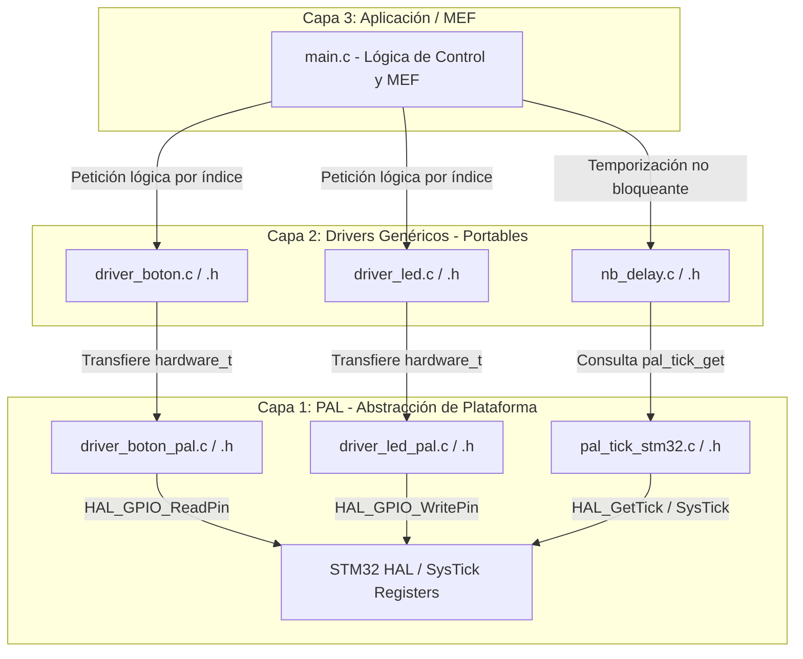

# APP 1.2 - Secuencia de LEDs Bidireccional con Temporización No Bloqueante (STM32)

## Título y Objetivos
* **Implementar una arquitectura de software portable en 3 capas:** Separar la lógica de aplicación (Capa 3), los drivers genéricos independientes del silicio (Capa 2) y la Capa de Abstracción de Plataforma / PAL (Capa 1).
* **Control de periféricos mediante abstracción:** Gestionar una secuencia de LEDs y la captura de eventos de pulsador mediante índices lógicos desacoplados del silicio.
* **Temporización no bloqueante y determinismo:** Reemplazar esperas bloqueantes por el driver genérico `nb_delay`, permitiendo la ejecución fluida del lazo principal a máxima velocidad sin latencias parásitas.

---

## Especificaciones del Circuito
* **Placa de Desarrollo:** NUCLEO-F439ZI (STM32F439ZI)
* **Entradas:** 1x Pulsador de Usuario (`USER_Btn`, activo alto).
* **Salidas:** 3x LEDs de Usuario (LD1 Verde, LD2 Azul, LD3 Rojo).

---

## Teoría de Operación
El sistema ejecuta una **Máquina de Estados Finitos (MEF)** que conmuta cíclicamente una serie de $N$ LEDs con intervalos de 200 ms.

1. **Inversión de Sentido y Antirrebote:**  
   En cada iteración del lazo principal, se evalúa el pulsador mediante `BOTON_DetectarFlancoPresionado()`. La lectura se procesa dentro de una ventana de guarda no bloqueante gobernada por `nb_delay` para filtrar rebotes mecánicos (*contact bounce*). Al detectar un flanco ascendente válido, se invierte el valor de `sentido` ($1 \leftrightarrow -1$).
2. **Ciclo de Estados y Lógica Circular:**  
   La MEF reside dentro del evento condicional de expiración de `nb_delay_read()`. Al completar la fase de apagado, actualiza la posición del siguiente LED sumando el valor de `sentido`:

   $$\text{indice\_led} \leftarrow \text{indice\_led} + \text{sentido}$$

   La lógica circular previene desbordamientos de memoria dentro del arreglo:

   $$\text{indice\_led} = \begin{cases} 0 & \text{si } \text{indice\_led} \ge \text{LED\_GetCount()} \\ \text{LED\_GetCount()} - 1 & \text{si } \text{indice\_led} < 0 \end{cases}$$

---

## Arquitectura del Software



### Detalle Capa 1: Abstracción de Plataforma (PAL)
Es la única capa acoplada a la HAL y registros del STM32. Mapea puertos, pines y provee la base de tiempo de 1 ms.

#### `pal_tick_stm32.h`
```c
typedef uint32_t tick_t;

tick_t pal_tick_get(void);
```

#### pal_tick_stm32.c
```c
#include "pal_tick_stm32.h"
#include "stm32f4xx_hal.h"

tick_t pal_tick_get(void) {
    return (tick_t)HAL_GetTick();
}
```

#### driver_boton_pal.h
```c
typedef struct {
    GPIO_TypeDef* puerto;   ///< Puerto GPIO real de la MCU
    uint16_t pin;           ///< Pin físico real de la MCU
    Boton_Modo_t modo;      ///< Polaridad eléctrica
} BOTON_Hardware_t;

void BOTON_PAL_Init(const BOTON_Hardware_t* tabla, uint8_t cantidad);
bool BOTON_PAL_LeerPinFisico(uint8_t indice);
```

#### driver_led_pal.h
```c
typedef struct {
    GPIO_TypeDef* port;   ///< Puerto GPIO de la MCU
    uint16_t pin;         ///< Pin físico de la MCU
} LED_Hardware_t;

void LED_PAL_Init(const LED_Hardware_t* tabla, uint8_t cantidad);
void LED_PAL_Write(uint8_t indice, bool estado);
void LED_PAL_Toggle(uint8_t indice);
```

### Detalle Capa 2: Drivers Genéricos
Contiene la lógica abstracta independiente de la arquitectura del microcontrolador (100% portable a STM32, NXP LPC4337 o AVR).

* **Driver de Retardo No Bloqueante (`nb_delay`):** Gestiona temporizadores por software sin detener el pipeline del microcontrolador. Opera mediante aritmética modular `uint32_t` resistente al *overflow* del contador.
* **Driver de Botones (`driver_boton`):** Registra el historial de estados de pines físicos para capturar flancos limpios.
* **Driver de LEDs (`driver_led`):** Administra el encendido, apagado y conmutación de actuadores lumínicos a partir de índices numéricos abstractos.

#### `nb_delay.c`
```c
#include "nb_delay.h"

void nb_delay_init(nb_delay_t * delay, tick_t duration) {
    if ((delay == NULL) || (duration == 0U)) return;
    delay->duration = duration;
    delay->running = false;
    delay->startTime = 0U;
}

bool_t nb_delay_read(nb_delay_t * delay) {
    bool_t timeReached = false;
    if ((delay == NULL) || (delay->duration == 0U)) return false;

    if (!delay->running) {
        delay->startTime = pal_tick_get();
        delay->running = true;
    } else {
        if ((pal_tick_get() - delay->startTime) >= delay->duration) {
            timeReached = true;
            delay->running = false;
        }
    }
    return timeReached;
}

void nb_delay_write(nb_delay_t * delay, tick_t duration) {
    if ((delay == NULL) || (duration == 0U)) return;
    delay->duration = duration;
}
```

### Detalle Capa 3: Aplicación (main.c)
```c
#include "main.h"
#include "driver_led.h"
#include "driver_boton.h"
#include "nb_delay.h"

#define INDICE_BTN_USER 0U

static const BOTON_Hardware_t tabla_botones_hw[] = {
    [INDICE_BTN_USER] = {USER_Btn_GPIO_Port, USER_Btn_Pin, BOTON_ACTIVO_ALTO}
};

static const LED_Hardware_t tabla_leds_hardware[] = {
    {LD1_GPIO_Port, LD1_Pin},
    {LD2_GPIO_Port, LD2_Pin},
    {LD3_GPIO_Port, LD3_Pin}
};

static const tick_t tiempo_alternancia = 200U;
static const tick_t tiempo_debounce = 50U;
static int8_t indice_led = 0;
static Estado_t estado_mef = Estado_Encendido;
static int8_t sentido = 1;

static nb_delay_t delay_mef;
static nb_delay_t delay_debounce;

int main(void) {
    HAL_Init();
    SystemClock_Config();
    MX_GPIO_Init();

    LED_Init(tabla_leds_hardware, sizeof(tabla_leds_hardware)/sizeof(tabla_leds_hardware[0]));
    BOTON_Init(tabla_botones_hw, sizeof(tabla_botones_hw)/sizeof(tabla_botones_hw[0]));
    nb_delay_init(&delay_mef, tiempo_alternancia);
    nb_delay_init(&delay_debounce, tiempo_debounce);

    while (1) {
        /* 1. Muestreo de pulsador con guarda de antirrebote */
        if (nb_delay_read(&delay_debounce)) {
            if (BOTON_DetectarFlancoPresionado(INDICE_BTN_USER)) {
                sentido = -sentido;
            }
        }

        /* 2. MEF de secuencia gobernada por nb_delay */
        if (nb_delay_read(&delay_mef)) {
            switch (estado_mef) {
            case Estado_Encendido:
                LED_Write((uint8_t)indice_led, true);
                estado_mef = Estado_Apagado;
                break;

            case Estado_Apagado:
                LED_Write((uint8_t)indice_led, false);
                indice_led += sentido;

                if (indice_led >= (int8_t)LED_GetCount()) {
                    indice_led = 0;
                } else if (indice_led < 0) {
                    indice_led = (int8_t)LED_GetCount() - 1;
                }

                estado_mef = Estado_Encendido;
                break;

            default:
                for (uint8_t j = 0U; j < LED_GetCount(); j++) {
                    LED_Write(j, false);
                }
                indice_led = 0;
                sentido = 1;
                estado_mef = Estado_Encendido;
                break;
            }
        }
    }
}
```

## Detalles de Robustez
* **Validación Defensiva de Punteros:** Todas las funciones de las Capas 1 y 2 validan `NULL` y rangos de índice previo a cualquier desreferenciación, previniendo excepciones *HardFault*.
* **Aritmética Modular Segura ante Overflow:** El cómputo `(pal_tick_get() - delay->startTime) >= delay->duration` en enteros de 32 bits sin signo (`uint32_t`) resuelve de forma matemática el paso por cero del contador SysTick (cada ~49.7 días).
* **Gestión Estática de Memoria:** Se prescinde por completo de asignación dinámica (`malloc`/`free`). Todas las estructuras y variables residen en memoria estática con alcance restringido (`static`).
* **Mapeo de Hardware en Memoria Flash:** Las tablas de configuración de hardware se declaran como `const` para residir en ROM/Flash, preservando la memoria RAM para variables de ejecución.

---

## Mapeo de Hardware

| Componente | Etiqueta en HAL | Puerto GPIO | Pin Físico | Configuración Electrónica |
| :--- | :--- | :--- | :--- | :--- |
| **LED 1 (Verde)** | `LD1_Pin` | `GPIOB` | `GPIO_PIN_0` | Salida Push-Pull / Activo Alto |
| **LED 2 (Azul)** | `LD2_Pin` | `GPIOB` | `GPIO_PIN_7` | Salida Push-Pull / Activo Alto |
| **LED 3 (Rojo)** | `LD3_Pin` | `GPIOB` | `GPIO_PIN_14` | Salida Push-Pull / Activo Alto |
| **Pulsador Usuario** | `USER_Btn_Pin` | `GPIOC` | `GPIO_PIN_13` | Entrada Digital / Activo Alto |

---

## Conclusión
La inclusión del driver genérico `nb_delay` junto con la capa `pal_tick_stm32` consolida una arquitectura modular desacoplada del silicio. La eliminación de demoras bloqueantes optimiza el tiempo de CPU y garantiza una respuesta inmediata a los eventos de entrada del pulsador, manteniendo la portabilidad total del firmware hacia plataformas como LPC4337 (EDU-CIAA) y AVR.