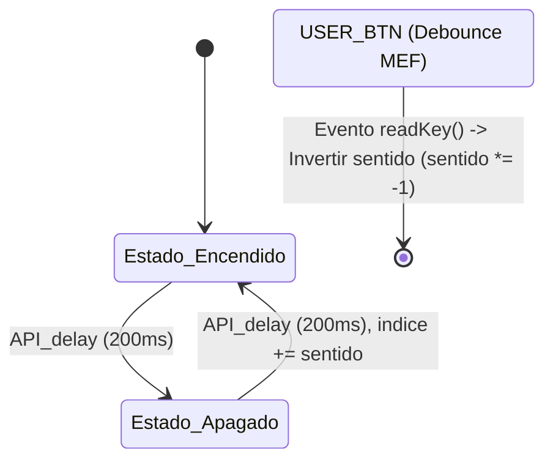

# App 1.2: Secuenciador Bidireccional No Bloqueante con Drivers Propios

## Título y Objetivos
**App 5.2: Secuenciador de LEDs Bidireccional Basado en Capas y Retardos No Bloqueantes**

El objetivo de esta aplicación es implementar una secuencia de encendido y apagado de los LEDs integrados de la placa de desarrollo mediante una arquitectura de software robusta, escalable y totalmente no bloqueante. Se incorpora la capacidad de invertir el sentido de la secuencia en tiempo de ejecución utilizando un pulsador de usuario procesado con un algoritmo de antirrebote (Debounce) por Máquina de Estados Finitos (MEF), apoyándose en drivers propios independientes de la placa.

## Especificaciones del Circuito
- **Hardware:** Placa de desarrollo STM32 con LEDs LD1 (Green), LD2 (Blue), LD3 (Red) y pulsador de usuario (USER_BTN).
- **Temporización:** Base de tiempo asíncrona de 200 ms por estado basada en el SysTick, sin uso de bloqueos por CPU (`HAL_Delay`).
- **Control de Entrada:** Pulsador de usuario con filtrado temporal de rebotes mecánicos (40 ms).

## Teoría de Operación
El sistema opera de forma totalmente asíncrona dividiendo las responsabilidades en dos flujos principales gestionados desde el bucle principal (`while(1)`):
1. **Gestión de Entradas:** La MEF de antirrebote evalúa periódicamente el estado físico del botón para filtrar ruido eléctrico en ambos flancos (subida y bajada). Al confirmar una pulsación válida, un flag *Clear-on-Read* señaliza el evento.
2. **Secuencia de LEDs:** Una MEF bidireccional regula el encendido y apagado cíclico de los elementos de iluminación. El avance del índice se ve afectado por la variable `sentido` (1 o -1), la cual se invierte cada vez que se detecta una pulsación válida del usuario. Todo el control de tiempos se realiza mediante retardos no bloqueantes.

## Arquitectura del Software
El diseño del software se organiza estrictamente en un esquema de **3 capas** para garantizar la portabilidad y el desacoplamiento del hardware:

- **Capa 1 (Hardware Mapping & Descriptores):** Definición de estructuras de configuración (`led_t`, `button_t`) que encapsulan los puertos, pines y polaridades lógicas, permitiendo instanciar múltiples dispositivos de forma genérica.
- **Capa 2 (Drivers Propios):** Módulos de abstracción independientes (`API_led`, `API_delay`, `API_debounce`) que resuelven el manejo de pines lógicos, la temporización modular segura ante desbordes del SysTick y el filtrado de entradas.
- **Capa 3 (Aplicación):** Lógica de negocio principal compuesta por la máquina de estados del secuenciador y la vinculación de eventos de usuario.

### Diagrama de Estados



### Detalle Capa 1 (Descriptores de Hardware)
Estructuras de configuración para desacoplar el código de los registros físicos específicos del fabricante:

```c
/**
 * @brief Enumeración para definir la lógica de polaridad del LED.
 */
typedef enum {
    LED_LOGIC_ACTIVE_HIGH = 0, /**< El LED enciende con nivel alto (SET). */
    LED_LOGIC_ACTIVE_LOW       /**< El LED enciende con nivel bajo (RESET) - Lógica invertida. */
} led_logic_t;

/**
 * @brief Estructura que define un objeto LED mediante sus parámetros de hardware.
 */
typedef struct {
    GPIO_TypeDef* port;     /**< Puntero al puerto GPIO (Ej: GPIOF). */
    uint16_t pin;           /**< Número del pin GPIO (Ej: GPIO_PIN_13). */
    led_logic_t logic;      /**< Define si el LED es de lógica activa alta o baja. */
} led_t;

/**
 * @brief Estructura de control para una instancia de botón.
 * @details Contiene tanto la configuración de hardware como la memoria de estado
 *          necesaria para que el driver sea reentrante.
 */
typedef struct {
    GPIO_TypeDef* port;     /**< Puerto GPIO asociado (ej: GPIOB). */
    uint16_t pin;           /**< Pin GPIO asociado (ej: GPIO_PIN_11). */
    bool inverted;          /**< Lógica: true para Active Low, false para Active High. */
    bool keyPressed;        /**< Flag de evento: indica que ocurrió una pulsación válida. */
    debounceState_t state;  /**< Memoria de estado de la MEF para este botón. */
    delay_t timer;          /**< Objeto de retardo para el filtrado de este botón. */
} button_t;

```

### Detalle Capa 2 (Drivers y Funciones de Abstracción)

Utilización de las interfaces genéricas provistas por las APIs para operar los dispositivos:

```c
// Encendido del LED actual mediante el driver API_led
LED_On(&leds_array[indice]);

// Verificación de retardo asíncrono no bloqueante
if (delayRead(&led_timer)) {
    estado_secuencia = ESTADO_APAGADO;
}

// Actualización de la MEF del botón y lectura de eventos
debounceFSM_Update(&user_button);
if (readKey(&user_button)) {
    sentido *= -1;
}
```

### Detalle Capa 3 (Lógica de Aplicación y Navegación)

Implementación de la MEF de control bidireccional y actualización circular del arreglo:
```c
		/* 3. Máquina de Estados Finitos (MEF) para la secuencia de LEDs basada en tiempos no bloqueantes */
		switch (estado_secuencia) {
		case ESTADO_ENCENDIDO:
			// Encendemos el LED actual utilizando el driver API_led
			LED_On(&leds_array[indice]);

			// Esperamos el tiempo configurado de forma no bloqueante
			if (delayRead(&led_timer)) {
				estado_secuencia = ESTADO_APAGADO;
			}
			break;

		case ESTADO_APAGADO:
			// Apagamos el LED actual mediante API_led
			LED_Off(&leds_array[indice]);

			if (delayRead(&led_timer)) {
				// Actualización del índice según la dirección actual (sentido)
				indice += sentido;

				// Lógica circular para mantener el índice dentro de los límites del arreglo
				if (indice >= cant_leds) {
					indice = 0;
				} else if (indice < 0) {
					indice = cant_leds - 1;
				}

				estado_secuencia = ESTADO_ENCENDIDO;
			}
			break;

		default:
			// Recuperación ante estados indeterminados
			LED_All_Off(leds_array, cant_leds);
			estado_secuencia = ESTADO_ENCENDIDO;
			indice = 0;
			delayReset(&led_timer);
			break;
		}
```

## Detalles de Robustez
- **Protección contra desborde (SysTick Roll-over):** La resta modular de enteros sin signo en `API_delay` (`HAL_GetTick() - startTime >= duration`) previene fallos catastróficos a los ~49.7 días de funcionamiento continuo.
- **Validación de Punteros:** Todas las funciones de las APIs validan que los punteros recibidos no sean `NULL` antes de operar sobre la memoria.
- **Antirrebote Robusto por MEF:** El filtrado temporal de 40 ms en ambos flancos evita falsos disparos por rebotes mecánicos del pulsador táctil.
- **Recuperación Automática (Default State):** Las máquinas de estados contemplan ramas `default` para apagar los actuadores y reiniciar los índices ante cualquier condición transitoria anómala.

## Mapeo de Hardware
| Elemento | Puerto | Pin | Función / Descripción |
| :--- | :--- | :--- | :--- |
| **LD1** | GPIOB | LD1_Pin | LED Verde de usuario (Salida) |
| **LD2** | GPIOB | LD2_Pin | LED Azul de usuario (Salida) |
| **LD3** | GPIOB | LD3_Pin | LED Rojo de usuario (Salida) |
| **USER_BTN** | GPIOC | USER_BTN_Pin | Pulsador de usuario (Entrada digital) |

## Conclusión
La migración hacia una arquitectura basada en drivers propios y diseño no bloqueante demuestra el salto cualitativo hacia un firmware de calidad profesional. El uso de descriptores (`led_t`, `button_t`), sumado a la separación en capas, permite escalar fácilmente la aplicación (añadiendo más LEDs o botones) manteniendo un código limpio, altamente portable entre arquitecturas de microcontroladores y completamente libre de demoras bloqueantes en la CPU.