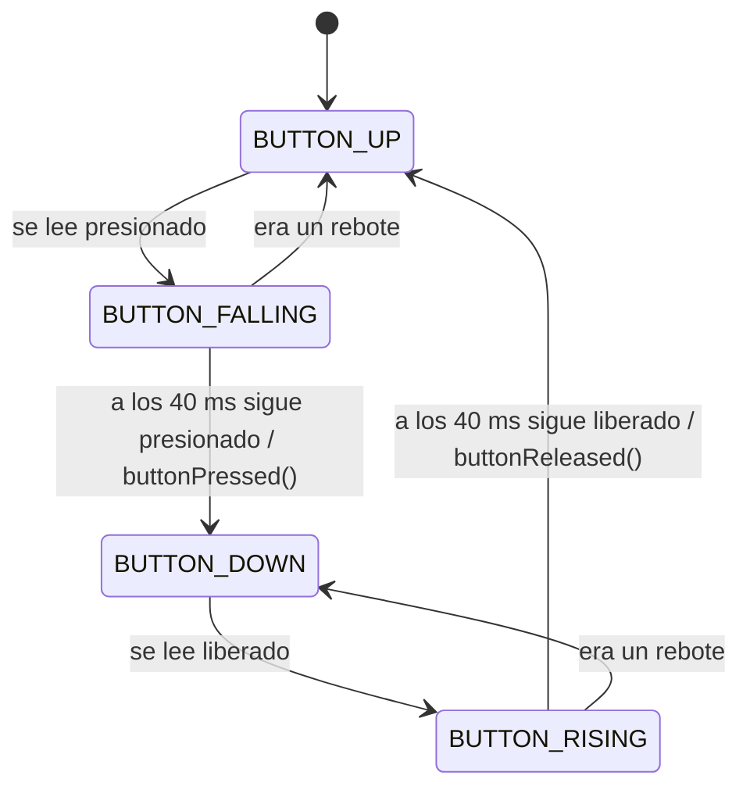

# AFP 5 — Antirrebote con máquina de estados

**Técnicas Digitales II — UTN FRT — Grupo 6 — 2026**

En esta actividad las aplicaciones de la [AFP 4](../AFP_4_Grupo_6_TDII) se vuelven a entregar con un **driver antirrebote** para el pulsador. Además, por pedido de la cátedra, todo el grupo pasa a usar los mismos drivers y los mismos nombres de variables.

## Objetivos de la actividad

- Implementar un driver antirrebote basado en una máquina de estados finitos (MEF).
- Integrarlo en las aplicaciones anteriores, junto con los retardos no bloqueantes.
- Presentar las aplicaciones funcionando y defender lo realizado.

## Por qué hace falta

Un pulsador mecánico no pasa limpiamente de un estado a otro: durante unos milisegundos la señal rebota. Sin filtrar, una sola pulsación puede contarse varias veces. El driver confirma cada cambio con una segunda lectura **40 ms** después, usando un retardo no bloqueante, y recién entonces lo da por válido.

## Qué se incorpora

La MEF tiene cuatro estados:



Interfaz del driver `API_debounce`:

```c
typedef enum {
    BUTTON_UP,
    BUTTON_FALLING,
    BUTTON_DOWN,
    BUTTON_RISING
} debounceState_t;

void   debounceFSM_init(void);                /* Carga el estado inicial            */
void   debounceFSM_update(bool_t buttonRead); /* Se llama en cada vuelta del lazo   */
void   buttonPressed(void);                   /* Evento: pulsación confirmada       */
void   buttonReleased(void);                  /* Evento: liberación confirmada      */
bool_t readKey(void);                         /* true una sola vez por pulsación    */
```

Uso típico en `main.c`:

```c
debounceFSM_update(readButton_GPIO());
if (readKey())
{
    /* Acción que corresponde a una pulsación */
}
```

## Drivers unificados

Desde esta actividad, los cuatro proyectos usan los mismos tres drivers en `Drivers/API/Inc` y `Drivers/API/Src`:

| Driver | Qué resuelve | Funciones |
| :--- | :--- | :--- |
| `API_GPIO` | LEDs y pulsador | `MX_GPIO_Init`, `writeLedOn_GPIO`, `writeLedOff_GPIO`, `toggleLed_GPIO`, `readButton_GPIO` |
| `API_delay` | Retardos no bloqueantes | `delayInit`, `delayRead`, `delayWrite` |
| `API_debounce` | Antirrebote del pulsador | `debounceFSM_init`, `debounceFSM_update`, `buttonPressed`, `buttonReleased`, `readKey` |

Los nombres de variables de `main.c` también se unifican: un mismo concepto lleva el mismo nombre en todas las aplicaciones (por ejemplo `LEDS`, `CANT_LEDS`, `indiceLed`, `delayLeds`, `T_ON`, `T_OFF`).

## Aplicaciones

| App | Responsable | Placa | Carpeta |
| :---: | :--- | :--- | :--- |
| 1.1 | Santino Machin | NUCLEO-F429ZI | [`App_5_1_Grupo_6_2026`](App_5_1_Grupo_6_2026) |
| 1.2 | Carlos Mamani Flores | NUCLEO-F439ZI | Pendiente |
| 1.3 | Federico Mayol | NUCLEO-F767ZI | [`App_5_3_Grupo_6_2026`](App_5_3_Grupo_6_2026) |
| 1.4 | Lucas Emanuel Cusi | STM32F401RC | [`App_5_4_Grupo_6_2026`](App_5_4_Grupo_6_2026) y [`App_5_4_v2_Grupo_6_2026`](App_5_4_v2_Grupo_6_2026) |

### Qué debe cumplir cada aplicación

| App | Comportamiento (igual al de la AFP 0) | Tarea en esta actividad |
| :---: | :--- | :--- |
| 1.1 | Secuencia verde → azul → rojo, 200 ms encendido y 200 ms apagado | Usar los drivers unificados. Como la secuencia original no usa pulsador, se agregó una función: cada pulsación pausa o reanuda la secuencia. |
| 1.2 | La secuencia invierte su sentido con cada pulsación | Detectar la pulsación con `readKey` |
| 1.3 | Cuatro secuencias; el pulsador pasa a la siguiente | Detectar la pulsación con `readKey` |
| 1.4 | Parpadeo conjunto; el pulsador cambia entre 100, 250, 500 y 1000 ms | Detectar la pulsación con `readKey` |

El detalle de cada secuencia está en el [README de la AFP 0](../AFP_0_Grupo_6_TDII).

### App 5.3 — detalle

- `main.c` tiene dos funciones: `iniciarSecuencia()`, que apaga los LEDs y prepara la secuencia elegida, y `actualizarSecuencia()`, que ejecuta un paso sin bloquear.
- La secuencia 1 usa `T_ON` y `T_OFF` (150 ms); la 2 usa `T_SEQ2` (300 ms); la 3 usa un retardo por LED (100, 300 y 600 ms); la 4 usa `T_SEQ4` (150 ms).
- En `API_debounce.c`, `buttonPressed()` y `buttonReleased()` están vacías porque los LEDs los maneja la secuencia. Para la prueba del driver que pide la consigna (invertir LED1 al presionar y LED3 al liberar) alcanza con descomentar la línea de cada una.
- `MX_GPIO_Init()` está en `API_GPIO.c`, como indica la guía de la cátedra. Si se regenera el código desde el `.ioc`, hay que volver a quitarla de `main.c`.

### App 5.4 — dos versiones

- `App_5_4_Grupo_6_2026` es la versión original: funciona, pero resuelve el antirrebote con un driver propio (`API_Button`) que tiene otros nombres.
- `App_5_4_v2_Grupo_6_2026` es la misma aplicación con los drivers unificados (`API_delay`, `API_debounce`). Los LEDs externos conservan las etiquetas `LED1`, `LED2`, `LED3`, porque en la NUCLEO-F401RE `LD2` ya es el LED integrado.

## Pendientes

- Subir la App 5.2.
- Probar en la placa la App 5.4 v2 y dejar una sola versión de la 5.4.
