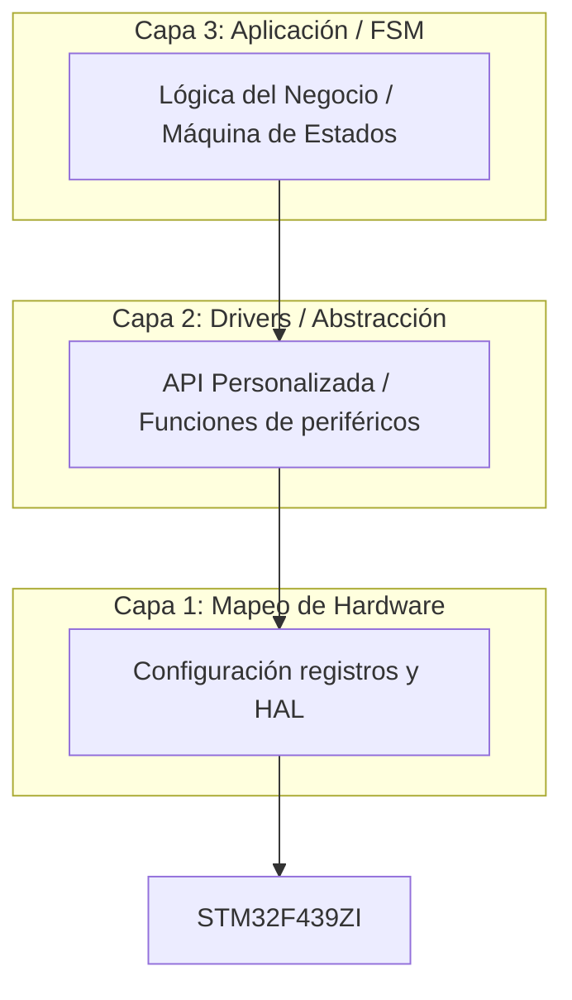

# Técnicas Digitales 2 - UTN FRT
## Grupo 6: Laboratorio de Sistemas Embebidos

### 1. Título y Objetivos
**Título:** Repositorio de Prácticas y Proyectos - STM32F439ZI
**Objetivo:** Este repositorio centraliza el desarrollo de aplicaciones embebidas realizadas por el Grupo 6. El propósito es aplicar los conceptos de la cátedra de Técnicas Digitales 2, utilizando la arquitectura STM32, el IDE STM32Cube y la capa de abstracción HAL de STMicroelectronics, manteniendo un estándar de calidad, robustez y documentación profesional.

### 2. Especificaciones del Circuito
* **Microcontrolador:** STM32F439ZI (Cortex-M4).
* **Kit de Desarrollo:** NUCLEO-F439ZI.
* **Entorno de Desarrollo:** STM32CubeIDE v1.9.
* **Capa de Abstracción:** ST HAL (Hardware Abstraction Layer).
* **Lenguaje:** C (Estándar C11).

### 3. Teoría de Operación
El funcionamiento se basa en la configuración de periféricos de bajo nivel (GPIO, EXTI, Timers, ADC, UART, etc.) gestionados a través de la capa HAL. Se prioriza la configuración de relojes (RCC) y el manejo de interrupciones para garantizar un comportamiento en tiempo real eficiente. La lógica se separa estrictamente de la inicialización del hardware para asegurar la modularidad.

### 4. Arquitectura del Software
Para garantizar la escalabilidad y el orden, adoptamos una arquitectura de tres capas:



* **Capa 1 (Mapeo de Hardware):** Inicialización de periféricos generada por el `.ioc` y configuración de registros.
* **Capa 2 (Drivers/Abstracción):** APIs desarrolladas por el grupo que encapsulan funciones de la HAL, permitiendo que la lógica sea independiente de la plataforma.
* **Capa 3 (Aplicación):** Lógica del sistema, procesos y estados.

### 5. Detalles de Robustez
* **Documentación:** Código documentado siguiendo el estándar **Doxygen**.
* **Estándar:** Todos los archivos cumplen con el rótulo de autoría de la UTN FRT:

```c
/**
 * @file .c o .h
 * @author ALUMNO (UTN FRT)
 * @brief Implementación de...
 * @details Contiene la lógica de...
 * @version 1.0
 * @date 2026
 */
```
* **Manejo de Errores:** Implementación de callbacks de la HAL para la gestión de excepciones y errores de comunicación.

### 6. Mapeo de Hardware
| Periférico | Pin NUCLEO | Función |
| :--- | :--- | :--- |
| Ejemplo: LED LD2 | PA5 | Indicador de estado |
| Pendiente | Pendiente | Pendiente |

### 7. Integrantes
* **Mayol Federico** - Legajo: 55764
* **Machin Santino** - Legajo: [52797]
* **Mamani Flores Carlos** - Legajo: [Completar]
* **Cusi Lucas Emanuel** - Legajo: [Completar]

### 8. Conclusión
Este repositorio refleja el compromiso del Grupo 6 con el desarrollo de sistemas embebidos de alta calidad, promoviendo el orden, la reutilización de código mediante drivers propios y el aprendizaje continuo de la arquitectura ARM Cortex-M4.
