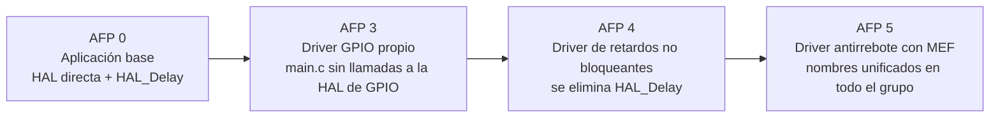
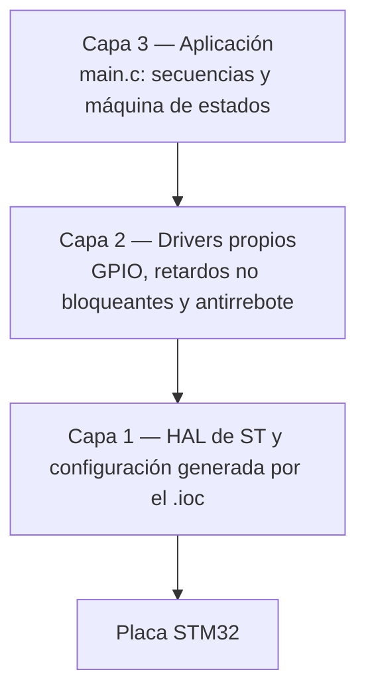

# Técnicas Digitales II — Grupo 6 — 2026

Repositorio grupal con los trabajos realizados para la materia **Técnicas Digitales II** de la carrera de Ingeniería Electrónica, **Universidad Tecnológica Nacional — Facultad Regional Tucumán (UTN FRT)**, ciclo lectivo **2026**.

Aquí se publican las aplicaciones desarrolladas en cada **Actividad de Formación Práctica (AFP)**: firmware en C para placas STM32, escrito con STM32CubeIDE y la capa HAL de STMicroelectronics.

## Integrantes

| Integrante | Legajo | GitHub | Aplicación a cargo | Placa utilizada |
| :--- | :---: | :--- | :---: | :--- |
| Machin, Santino | 53033 | [@santinomachin](https://github.com/santinomachin) | App 1.1 | NUCLEO-F429ZI |
| Mamani Flores, Carlos | 52797 | [@CarlitozMF](https://github.com/CarlitozMF) | App 1.2 | NUCLEO-F439ZI |
| Mayol, Federico | 55764 | [@Fedemayol024](https://github.com/Fedemayol024) | App 1.3 | NUCLEO-F767ZI |
| Cusi, Lucas Emanuel | 52769 | [@LucasEma912](https://github.com/LucasEma912) | App 1.4 | STM32F401RC |

**Cátedra:** Ing. Rubén Darío Mansilla (Profesor) — Ing. Lucas Abdala (ATTP).

## Cómo está organizado el trabajo

La materia propone cuatro aplicaciones base (App 1.1 a App 1.4) que usan los LEDs y el pulsador de la placa. Cada integrante toma una y **la vuelve a entregar en cada AFP incorporando un concepto nuevo**, sin cambiar lo que la aplicación hace. Por eso la misma aplicación aparece en varias carpetas: lo que cambia entre una y otra es *cómo* está construida.


```mermaid
graph LR
    A["AFP 0<br/>Aplicación base<br/>HAL directa + HAL_Delay"] --> B["AFP 3<br/>Driver GPIO propio<br/>main.c sin llamadas a la HAL de GPIO"]
    B --> C["AFP 4<br/>Driver de retardos no bloqueantes<br/>se elimina HAL_Delay"]
    C --> D["AFP 5<br/>Driver antirrebote con MEF<br/>nombres unificados en todo el grupo"]
```

| Actividad | Tema | Qué se incorpora | Carpeta |
| :--- | :--- | :--- | :--- |
| **AFP 0** | Entorno STM32CubeIDE y programación de microcontroladores | Las cuatro aplicaciones base, con HAL y retardos bloqueantes | [`AFP_0_Grupo_6_TDII`](AFP_0_Grupo_6_TDII) |
| **AFP 3** | Creación de drivers | Driver GPIO propio; `main.c` deja de llamar a la HAL de GPIO | [`AFP_3_Grupo_6_TDII`](AFP_3_Grupo_6_TDII) |
| **AFP 4** | Funciones no bloqueantes con SysTick | Driver de retardos no bloqueantes que reemplaza a `HAL_Delay()` | [`AFP_4_Grupo_6_TDII`](AFP_4_Grupo_6_TDII) |
| **AFP 5** | Antirrebote con máquina de estados | Driver antirrebote para el pulsador y nombres unificados de drivers y variables | [`AFP_5_Grupo_6_TDII`](AFP_5_Grupo_6_TDII) |

Cada carpeta tiene su propio README con los objetivos de la actividad, qué debe cumplir cada aplicación y quién la desarrolló.

## Las cuatro aplicaciones

| App | Qué hace | Responsable |
| :---: | :--- | :--- |
| **1.1** | Secuencia de los tres LEDs (verde → azul → rojo), 200 ms encendido y 200 ms apagado cada uno | Santino Machin |
| **1.2** | La secuencia de la App 1.1, que invierte su sentido cada vez que se presiona el pulsador | Carlos Mamani Flores |
| **1.3** | Cuatro secuencias distintas; el pulsador pasa de una a la siguiente | Federico Mayol |
| **1.4** | Los tres LEDs parpadean juntos; el pulsador cambia el tiempo entre 100, 250, 500 y 1000 ms | Lucas Emanuel Cusi |

Todas deben ser de carácter general: los LEDs se manejan con un vector, de modo que agregar más LEDs requiera cambios mínimos.

## Estado de las entregas

| App | AFP 0 | AFP 3 | AFP 4 | AFP 5 |
| :---: | :--- | :--- | :--- | :--- |
| **1.1** | Pendiente | [`App_3_1`](AFP_3_Grupo_6_TDII/App_3_1_Grupo_6_2026) | [`App_4_1`](AFP_4_Grupo_6_TDII/App_4_1_Grupo_6_2026) | Pendiente |
| **1.2** | [`App_1_2`](AFP_0_Grupo_6_TDII/App_1_2_Grupo_6_2026) | [`App_3_2`](AFP_3_Grupo_6_TDII/App_3_2_Grupo_6_2026) | [`App_4_2`](AFP_4_Grupo_6_TDII/App_4_2_Grupo_6_2026) | Pendiente |
| **1.3** | [`App_1_3`](AFP_0_Grupo_6_TDII/App_1_3_Grupo_6_2026) | [`App_3_3`](AFP_3_Grupo_6_TDII/App_3_3_Grupo_6_2026) | [`App_4_3`](AFP_4_Grupo_6_TDII/App_4_3_Grupo_6_2026) | [`App_5_3`](AFP_5_Grupo_6_TDII/App_5_3_Grupo_6_2026) |
| **1.4** | [`App_1_4`](AFP_0_Grupo_6_TDII/App_1_4_Grupo_6_2026) | [`App_3_4`](AFP_3_Grupo_6_TDII/App_3_4_Grupo_6_2026) | [`App_4_4`](AFP_4_Grupo_6_TDII/App_4_4_Grupo_6_2026) | Pendiente |

Cada carpeta se llama `App_N_Y_Grupo_6_2026`; en la tabla se abrevia el nombre.

## Convenciones del grupo

**Nombres de carpetas.** Una carpeta por actividad (`AFP_N_Grupo_6_TDII`) y, dentro, una por aplicación con el formato `App_N_Y_Grupo_6_2026`, donde `N` es el número de AFP e `Y` el número de aplicación (1 a 4).

**Drivers propios.** Van en `Drivers/API/Inc` y `Drivers/API/Src` de cada proyecto. Desde la AFP 5 son los mismos tres archivos en todas las aplicaciones: `API_GPIO`, `API_delay` y `API_debounce`.

**Arquitectura en capas.** La lógica de la aplicación no accede directamente al hardware:


```mermaid
graph TD
    A["Capa 3 — Aplicación<br/>main.c: secuencias y máquina de estados"] --> B["Capa 2 — Drivers propios<br/>GPIO, retardos no bloqueantes y antirrebote"]
    B --> C["Capa 1 — HAL de ST y configuración generada por el .ioc"]
    C --> D["Placa STM32"]
```

**Documentación del código.** Los archivos propios llevan encabezado Doxygen:

```c
/**
 * @file    nombre.c
 * @author  Apellido Nombre (UTN FRT)
 * @brief   Qué implementa el archivo.
 * @version 1.0
 * @date    2026
 */
```

## Herramientas

- **IDE:** STM32CubeIDE.
- **Lenguaje:** C.
- **Bibliotecas:** STM32Cube HAL (F4 o F7 según la placa) y CMSIS.
- **Placas:** cada integrante trabaja con la suya (ver tabla de integrantes), por lo que cada proyecto trae su propio `.ioc` y script de enlazado.

**Qué no se sube.** El `.gitignore` de la raíz deja fuera el espacio de trabajo del IDE (`.metadata`), las carpetas de compilación (`Debug`, `Release`) y las configuraciones de depuración (`.launch`). Se regeneran en cada computadora.

Para abrir una aplicación: en STM32CubeIDE, `File → Import → Existing Projects into Workspace` y seleccionar la carpeta de la aplicación.
